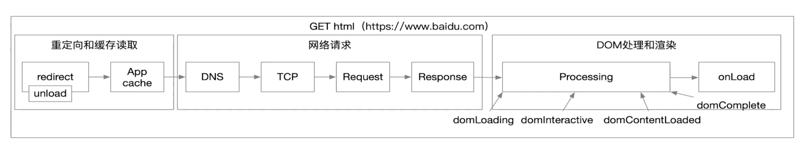
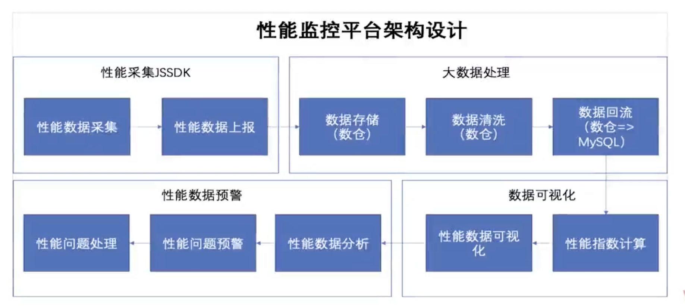

## 前端性能

### 为什么要去提升前端性能

> 提升用户使用体验，留存用户，活跃用户。

### 什么是前端性能

> 前端性能通常是指访问速度。但是怎么去衡量访问速度呢？所以我们应该先去监控前端性能。

### 如何优化前端性能
- 监控前端性能
- 优化前端性能

### 一个页面的生命周期构成

1. 重定向（redirect），卸载当前页面（unload）并加载新页面。（页面有内容）
2. 在缓存（App cache）中查找要访问的地址
3. 向http域名发起一个简单请求获取地址（DNS）。
4. 与服务器通信（TCP）
5. 向服务器发送真实请求（Request）
6. 服务器对客户端响应（Response）
7. 客户端对响应文件生成DOM节点（Processing）
8. 客户端加载外部资源或者多媒体资源（onload）

### 监控前端性能原理
- 核心指标：[FP、FOP、FMP、LCP](https://juejin.cn/post/7084481163137384479)
- 监控方法：[Pertormance](https://developer.mozilla.org/zh-CN/docs/Web/API/Performance)、[PertormanceObserver](https://developer.mozilla.org/zh-CN/docs/Web/API/PerformanceObserver/PerformanceObserver)

### 监控前端性能工具
- Chrome Performance
- 前端性能监控平台

### 优化前端性能

#### 优化原则：

1. 减少请求次数
2. 缩小资源体积
3. 提升网络速度
4. 优化加载方式

#### 网络请求优化：

1. 减少请求次数
2. 加快请求速度(HTTP请求：强缓存和协商缓存)
3. DNS缓存
4. 提升TCP连接速度(服务器带宽和性能、客户端网络带宽和性能、中间件服务器和优化）
5. 请求优化（请求头内容精简）
6. 响应优化 (gzip/压缩）
7. DOM优化(script放后，style放前）
8. 异步请求js (deter async)

参考文章： [前端优化：前端性能优化方法](https://blog.csdn.net/imagine_tion/article/details/114386029 )