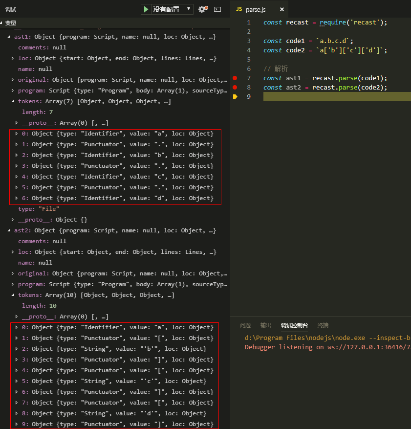
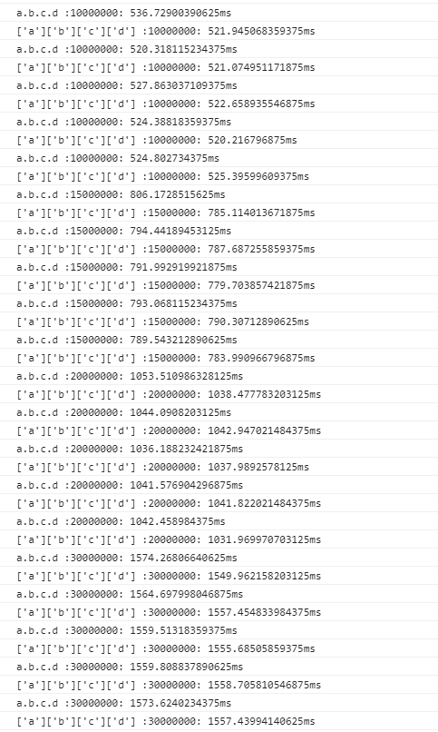

#### shu云面试题-1
先看下图：

在浏览器底层去解析的时候，你使用的字符和符号都会被转码解析：
- '.'每次解析一次，
- '['和']'因为是两个符号要两个解析才能完成。

'['和']'对比'.'要多解析一次，理论上是‘.’性能更优。


用代码直接开始性能测试
```
var list = ['a', 'b', 'c', 'd'];
/*
//这一节为了验证对象复杂度对其的影响..
//实际上由于Object是类似hash表的结构
//所以实际上注释或者放开对这道题的结论并不影响，只是最后的总耗时线性增加而已
[...Array(100).keys()].forEach(num=>{
    list.push(num);
})
*/
var testObj = {};

list.forEach(key => {
    testObj[key] = {};
    list.forEach(key1 => {
        testObj[key][key1] = {};
        list.forEach(key2 => {
            testObj[key][key1][key2] = {};
            list.forEach(key3 => {
                testObj[key][key1][key2][key3] = Math.floor(Math.random() * 10);
            })
        })
    })
})

function testTypeA(num){
    console.time(`a.b.c.d :${num}`);
    for(var i =0;i<num;i++){
        var value = testObj.a.b.c.d;
    }
    console.timeEnd(`a.b.c.d :${num}`);
}

function testTypeB(num){
    console.time(`['a']['b']['c']['d'] :${num}`);
    for(var i =0;i<num;i++){
        var value = testObj['a']['b']['c']['d'];
    }
    console.timeEnd(`['a']['b']['c']['d'] :${num}`);
}
//测试组，每组测5次
var testList = ['10000000','15000000','20000000','30000000']
testList.forEach(num=>{
    [...Array(5).keys()].forEach(()=>{
        testTypeA(num);
        testTypeB(num);
    })
})

```
发现每组测试运行多次的话，性能差距小到可以忽略不记，
有的时候['a']['b']['c']['d']还会快一些，所以说它性能差可能从模拟的角度有些站不住脚。

附上console结果


####结论：从浏览器运行解码机制还说：理论上是‘.’有微弱的性能优势，但是从实际代码来看。真的就不一定，如果面试的话回答'.'更快就好了。