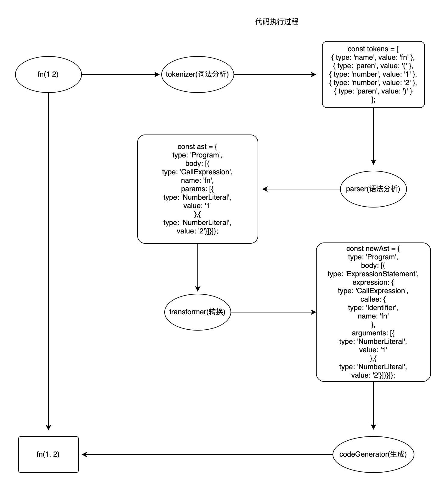

## 前言

babel，是我们前端工程化开发中，必须使用的一个工具链，主要用于在当前和旧的浏览器或环境中，将 ECMAScript 2015+ 代码转换为 JavaScript 向后兼容版本的代码。

但是在我的理解中balbel就是一个代码转换机。让我们写的代码都能被浏览器识别并执行。在阅读balbel官方[the-super-tiny-compiler ](https://github.com/jamiebuilds/the-super-tiny-compiler '点击跳转')给出的代码后，
大多数代码都会经历以下步骤：
- 解析（parse）
- 转换（transform）
- 生成（generate）

我们将执行下列代码作为事例演示：
```
fn(1 2);
```


## 解析（parse）
解析步骤接收代码并输出 AST。 这个步骤分为两个阶段：
- 词法分析（tokenizer）
- 语法分析（parser）


```
//  词法分析阶段把字符串形式的代码转换为 令牌（tokens） 流。
const tokens = [
  { type: 'name',   value: 'fn' },
  { type: 'paren',  value: '('  },
  { type: 'number', value: '1'  },
  { type: 'number', value: '2'  },
  { type: 'paren',  value: ')'  }
];

// 语法分析阶段会把一个令牌流转换成 AST 的形式。 这个阶段会使用令牌中的信息把它们转换成一个 AST 的表述结构，这样更易于后续的操作。

const ast = {
  type: 'Program',
  body: [{
    type: 'CallExpression',
    name: 'fn',
    params: [{
      type: 'NumberLiteral',
      value: '1'
    },{
      type: 'NumberLiteral',
      value: '2'
    }]
  }]
};

```


## 转换（transform）

这里的代码是最复杂的，但是逻辑很简单。大致分为以下几个步骤：
1. 声明一个newAst作为容器接受转换后的数据。
2. 调用traverser函数，传入AST和一个obj对象

```
    traverser(ast, {
        NumberLiteral: {
            enter(node, parent) {
                parent._context.push({
                    type: 'NumberLiteral',
                    value: node.value,
                });
            },
        },

        StringLiteral: {
            enter(node, parent) {
                parent._context.push({
                    type: 'StringLiteral',
                    value: node.value,
                });
            },
        },

        CallExpression: {
            enter(node, parent) {
                let expression = {
                    type: 'CallExpression',
                    callee: {
                        type: 'Identifier',
                        name: node.name,
                    },
                    arguments: [],
                };

                node._context = expression.arguments;

                if (parent.type !== 'CallExpression') {

                    expression = {
                        type: 'ExpressionStatement',
                        expression: expression,
                    };
                }

                parent._context.push(expression);
            },
        }
    });
```
3. 执行traverser；traverser内部是多个函数，不断递归调用 AST（因为AST是多位数组），在此过程中对节点进行添加、更新及移除等操作。
4. 返回newAST。
```
// 转换步骤接收 AST 并对其进行遍历，在此过程中对节点进行添加、更新及移除等操作。 这是 Babel 或是其他编译器中最复杂的过程 同时也是插件将要介入工作的部分

const newAst = {
  type: 'Program',
  body: [{
    type: 'ExpressionStatement',
    expression: {
      type: 'CallExpression',
      callee: {
        type: 'Identifier',
        name: 'fn'
      },
      arguments: [{
        type: 'NumberLiteral',
        value: '1'
      },{
        type: 'NumberLiteral',
        value: '2'
      }]
    }
  }]
};
```
## 生成（generate）
代码生成步骤把最终（经过一系列转换之后）的 AST 转换成字符串形式的代码，同时还会创建源码映射（source maps）。

代码生成其实很简单：深度优先遍历整个 AST，然后根据 type类型 判断、处理 拼接可以表示转换后代码的字符串。

下面的主要功能代码：

```
function codeGenerator(node) {

    switch (node.type) {

        case 'Program':
            return node.body.map(codeGenerator)
                .join('\n');

        case 'ExpressionStatement':
            return (
                codeGenerator(node.expression) +
                ';'
            );

        case 'CallExpression':
            return (
                codeGenerator(node.callee) +
                '(' +
                node.arguments.map(codeGenerator)
                    .join(', ') +
                ')'
            );

        case 'Identifier':
            return node.name;

        case 'NumberLiteral':
            return node.value;

        case 'StringLiteral':
            return '"' + node.value + '"';

        default:
            throw new TypeError(node.type);
    }
}
```
执行完上述代码后返回 fn(1, 2) 浏览器能正常执行的代码了

### 代码流程

